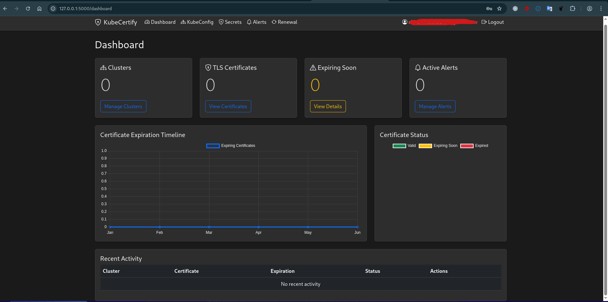

# KubeCertify - Kubernetes TLS Certificate Manager

A modern web application for managing Kubernetes TLS certificates, monitoring expiration dates, and handling certificate renewals.

## Features

- User authentication with email
- Kubeconfig file management
- TLS certificate monitoring
- Certificate expiration alerts
- Certificate renewal suggestions
- Dark theme UI
- Email notifications

## Setup

1. Create a virtual environment:
```bash
python -m venv .venv
source .venv/bin/activate  # On Linux/Mac
```

2. Install dependencies:
```bash
pip install -r requirements.txt
```

3. Set up environment variables:
```bash
cp .env.example .env
# Edit .env with your configuration
```

4. Run the application:
```bash
python app.py
```

## Development

The application is built with:
- Flask (Backend)
- Bootstrap 5 (Frontend)
- SQLAlchemy (Database)
- Kubernetes Python Client

## License

MIT License 